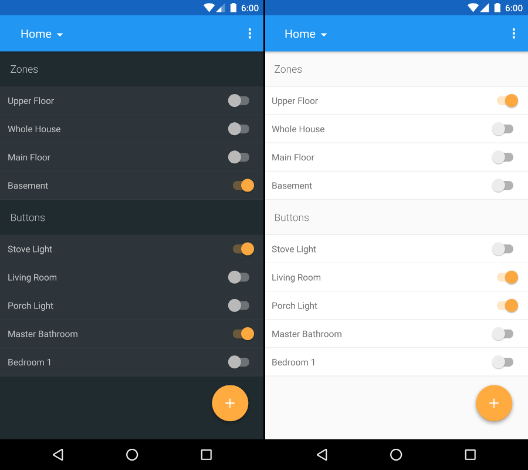

# Zone Beacon



### Building

`./gradlew build`

This will assemble the APK, sign it, minify it, and run tests on it.

### Testing

`./gradlew test`

### Organization

The app currently contains a few differnt modules:

1. app
2. api
3. test_helper

The `app` module contains all application specific code. The `api` module contains code 
related to connecting to a certain type of control unit. `api` also contains models for the 
database since they are shared with the API. Lastly, `test_helper` contains some abstracted 
testing classes that can and should be used in other modules.

### Play Store Release

There is a `debug.keystore` and a `keystore.jks` that are used for signing the application in
debug mode and release mode, respectively. Neither of these should be used for signing the app
to be released onto the Play Store!!! The best way to publish to the Play Store would be setting
the app up on a build server like Jenkins and replacing the `keystore.jks` file with a new, secure
version. To do this, a shell script like the following would work well:

```
wget -O keystore.jks <url-to-your-release-keystore-to-download>

cat > keystore.properties <<-EOF
keystorepassword=<your-keystore-password>
keyalias=<your-key-alias>
keypassword=<your-key-password>
EOF

cat > api_keys.properties <<-EOF
NEARBY=<your-google-nearby-api-key>
EOF

./gradlew clean build testDebugUnitTestCoverage
```

After running the above and replacing the appropriate fields, you'll have a build of the
app in `app/build/outputs/apk/Zone-Beacon-<version-number>-release.apk`. You'll also have
a test coverage file taken using JaCoCo in 
`app/build/reports/jacoco/testDebugUnitTestCoverage/html/index.html`